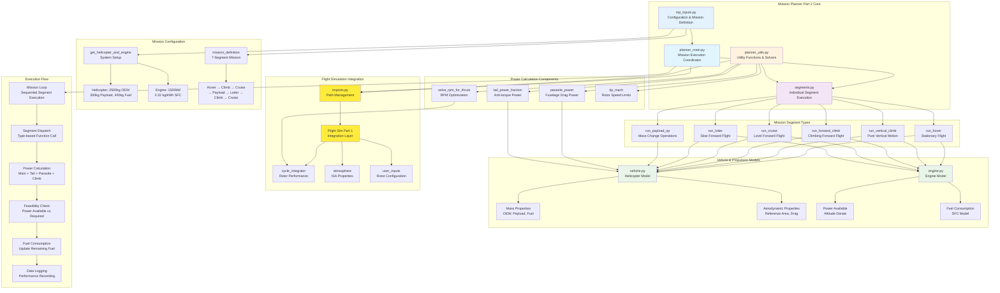

# Mission Planner Part 2 System Overview

## Mission Planner Part 2 Architecture

### Core Components

#### 1. Mission Execution Layer
- **planner_main.py**: Central mission coordinator
  - Loads helicopter, engine, and mission configuration
  - Executes segments sequentially with altitude tracking
  - Handles success/failure and comprehensive logging

- **segments.py**: Individual segment execution functions
  - Time-stepped simulation (1-second intervals)
  - Power calculations for each flight phase
  - Fuel consumption and feasibility checking

#### 2. Configuration Layer
- **mp_inputs.py**: System configuration and mission definition
  - Helicopter: 3200kg total mass (2500+300+400)
  - Engine: 1500kW with realistic fuel consumption
  - 7-segment mission profile for comprehensive testing

#### 3. Utility Layer
- **planner_utils.py**: Mathematical solvers and calculations
  - RPM optimization using bisection method
  - Power component calculations (parasite, tail)
  - Tip Mach number limiting for safety

#### 4. Vehicle Models
- **vehicle.py**: Helicopter mass and aerodynamic properties
- **engine.py**: Power availability and fuel consumption models

#### 5. Integration Layer
- **imports.py**: Dynamic path management for flight simulation integration
- Seamless connection to flight_sim_part1 components

### Mission Execution Flow

#### Sequential Process
1. **System Initialization**: Load helicopter, engine, rotor models
2. **Mission Loading**: Get predefined 7-segment mission
3. **Segment Loop**: Execute each segment with type dispatch
4. **Power Calculation**: Main rotor + tail + parasite + climb power
5. **Feasibility Check**: Verify power available vs required
6. **Fuel Update**: Calculate and subtract fuel consumption
7. **Data Logging**: Record comprehensive performance data
8. **Altitude Tracking**: Maintain current altitude for next segment

#### Power Components
- **Main Rotor**: From flight simulation cycle integrator
- **Tail Rotor**: Anti-torque power (7% hover → 1.5% cruise)
- **Parasite**: Fuselage drag power (0.5×ρ×V²×S×CD0×V)
- **Climb**: Gravitational power (Weight × climb_rate)

### Key Features
- **High Fidelity**: Integration with detailed flight simulation
- **Realistic Modeling**: Comprehensive power and fuel calculations
- **Robust Solving**: Bisection method for RPM optimization
- **Safety Limits**: Tip Mach number constraints
- **Comprehensive Logging**: Detailed mission performance records
- **Modular Design**: Clear separation of concerns and reusable components

### Mission Profile
**7-Segment Test Mission**:
1. Ground hover (60s) - System checkout
2. Vertical climb (120s to 360m) - Initial ascent
3. Cruise (300s at 45 m/s) - Transit to area
4. Payload drop (100kg with hover) - Mission task
5. Loiter (120s at 25 m/s) - Surveillance/patrol
6. Forward climb (60s to 420m) - Altitude change
7. Return cruise (240s at 50 m/s) - Return transit