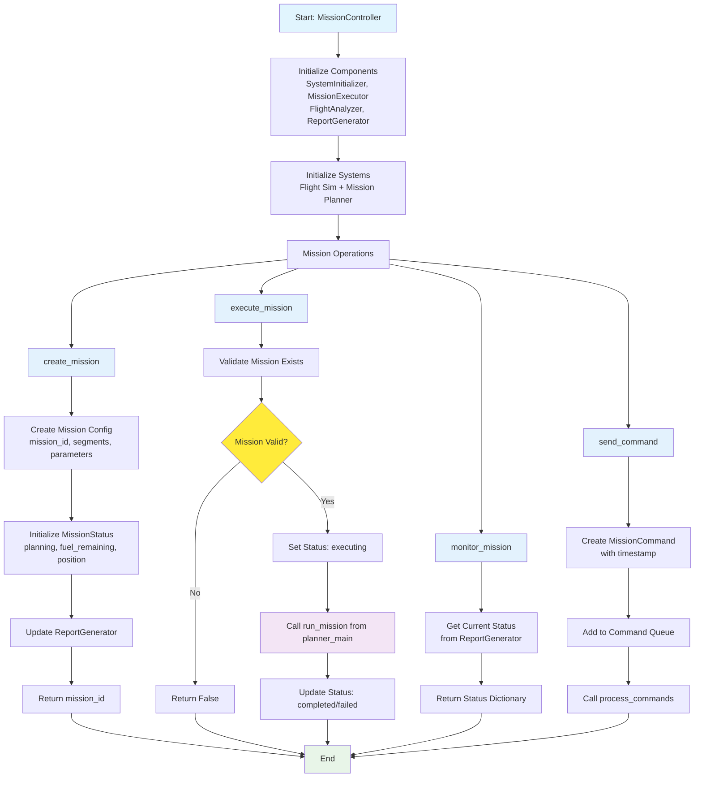

# Mission Controller Main Flow Diagram

## Class: MissionController
**Purpose**: Main orchestrator for mission planning and execution

### Key Components
- **SystemInitializer**: Sets up flight simulation and mission planner
- **MissionExecutor**: Handles mission execution and monitoring
- **FlightAnalyzer**: Calculates flight performance parameters
- **ReportGenerator**: Creates mission reports and status updates

### Main Operations
1. **create_mission**: Define mission segments and parameters
2. **execute_mission**: Run mission through planner execution engine
3. **monitor_mission**: Track real-time mission status
4. **send_command**: Issue control commands (pause/resume/abort)

### Integration Points
- Flight simulation system for performance calculations
- Mission planner for segment execution
- Command queue for real-time control