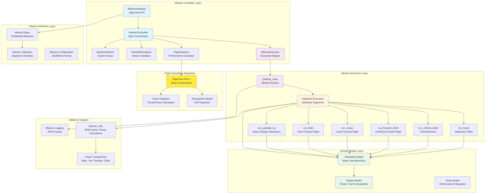

# Mission Planner System Overview

## Mission Planner System Architecture

### System Layers

#### 1. Mission Controller Layer
**Purpose**: High-level mission management and system integration
- **MissionInterface**: User-friendly API for mission operations
- **MissionController**: Central orchestrator coordinating all components
- **MissionExecutor**: Handles mission execution and real-time control
- **FlightAnalyzer**: Calculates flight performance parameters
- **FeasibilityAnalyzer**: Validates mission feasibility
- **SystemInitializer**: Sets up and validates system integration

#### 2. Mission Definition Layer
**Purpose**: Mission configuration and validation
- **MissionTypes**: Predefined mission templates (test, patrol, SAR, cargo)
- **Mission Validation**: Segment structure and parameter checking
- **Configuration Format**: JSON-based mission definitions

#### 3. Mission Execution Layer
**Purpose**: Execute individual mission segments
- **planner_main**: Main mission execution coordinator
- **Segment Functions**: Specialized execution for each flight phase
  - Hover, vertical climb, forward climb, cruise, loiter, payload operations
- **Time-stepped Simulation**: 1-second intervals with continuous monitoring

#### 4. Vehicle Models Layer
**Purpose**: Aircraft and propulsion system modeling
- **Helicopter Model**: Mass properties, aerodynamics, configuration
- **Engine Model**: Power availability, fuel consumption, altitude effects
- **Rotor Model**: Integration with flight simulation performance

#### 5. Flight Simulation Integration
**Purpose**: High-fidelity rotor performance calculations
- **Flight Sim Part 1**: Detailed rotor aerodynamics and performance
- **Atmospheric Model**: ISA standard atmosphere properties
- **Cycle Integrator**: Thrust and power calculations

#### 6. Utilities & Support
**Purpose**: Supporting calculations and data management
- **planner_utils**: RPM solving, power component calculations
- **Mission Logging**: Comprehensive JSON-based mission records
- **Power Components**: Main rotor, tail rotor, parasite, climb power

### Key Features
- **Modular Architecture**: Clear separation of concerns
- **Real-time Control**: Command queue for mission control
- **Comprehensive Logging**: Detailed mission performance records
- **Feasibility Analysis**: Pre-flight mission validation
- **Integration**: Seamless connection between mission planning and flight simulation