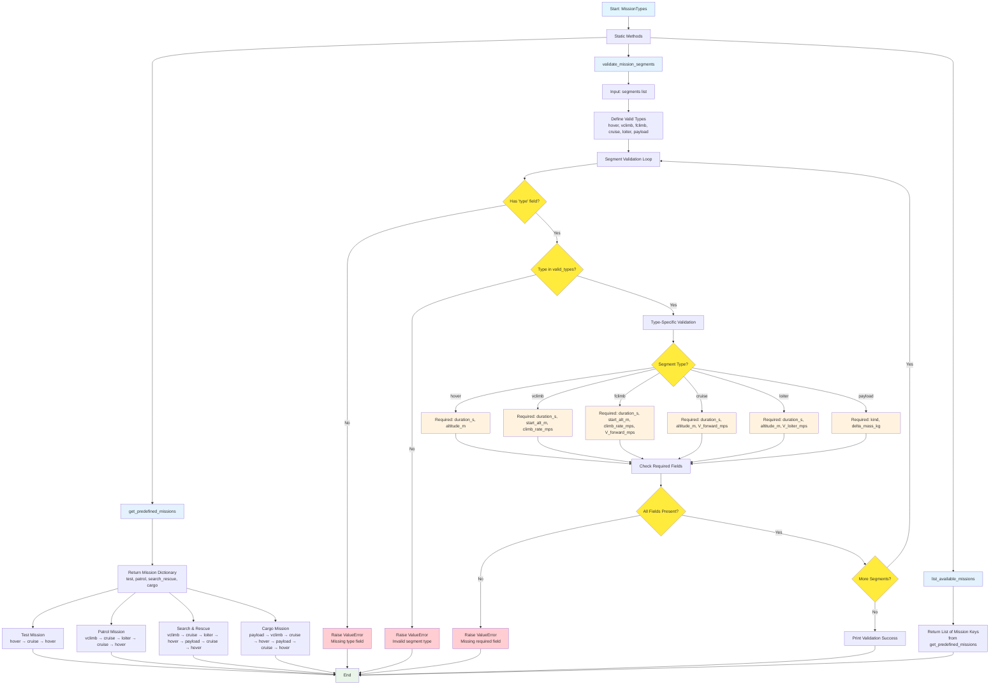

# Mission Types Flow Diagram

## Class: MissionTypes
**Purpose**: Define and validate predefined mission configurations

### Predefined Missions
1. **Test Mission**: Simple validation mission
   - hover → cruise → hover
   
2. **Patrol Mission**: Standard patrol pattern
   - vclimb → cruise → loiter → cruise → hover
   
3. **Search & Rescue**: SAR mission with payload
   - vclimb → cruise → loiter → hover → payload pickup → cruise → hover
   
4. **Cargo Mission**: Heavy lift transport
   - payload pickup → vclimb → cruise → hover → payload drop → cruise → hover

### Segment Validation
**Valid Segment Types**:
- **hover**: Stationary flight at altitude
- **vclimb**: Vertical climb/descent
- **fclimb**: Forward climbing flight
- **cruise**: Level forward flight
- **loiter**: Slow forward flight pattern
- **payload**: Pickup/drop operations

### Field Requirements
Each segment type has specific required fields that are validated:
- Duration, altitude, velocities as appropriate
- Payload operations require kind and mass change
- Climb segments require rates and starting altitudes