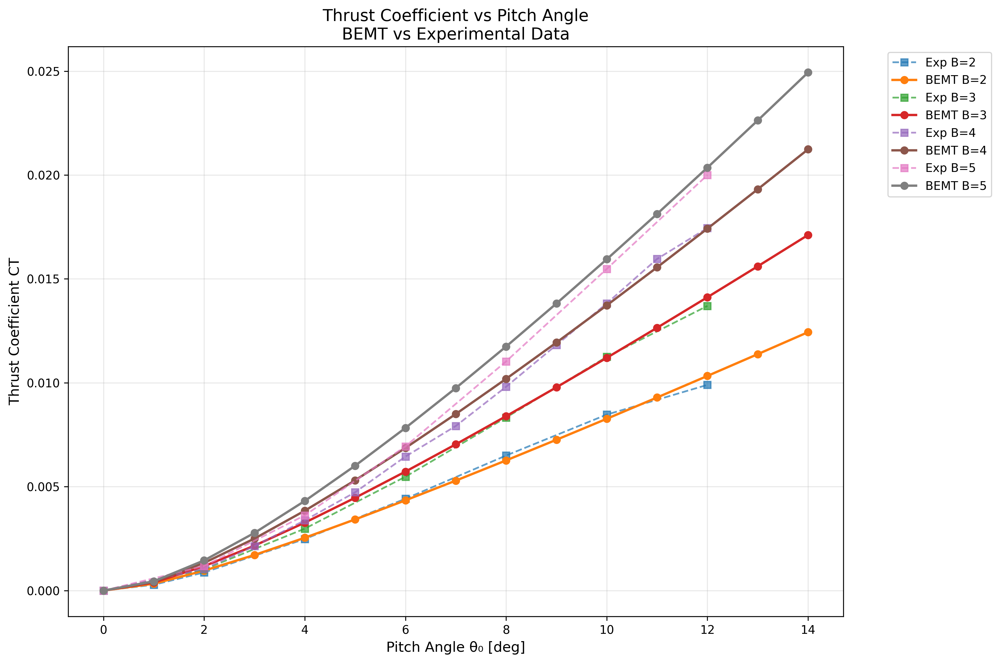
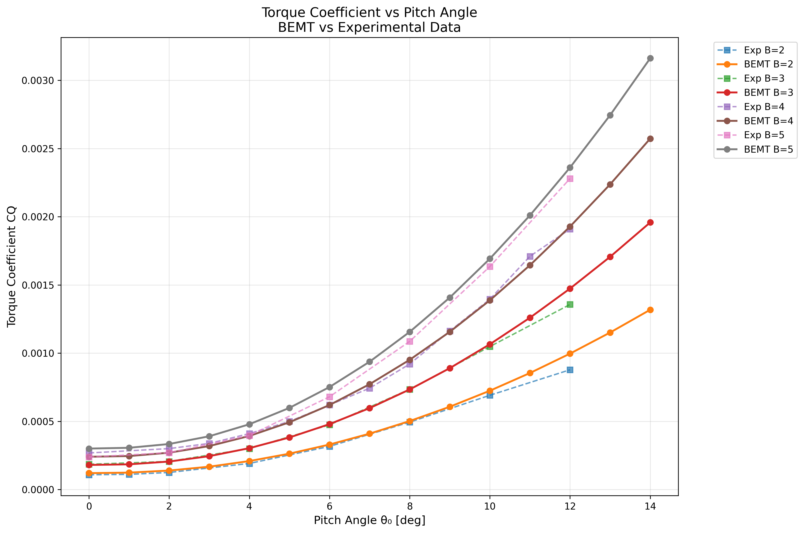
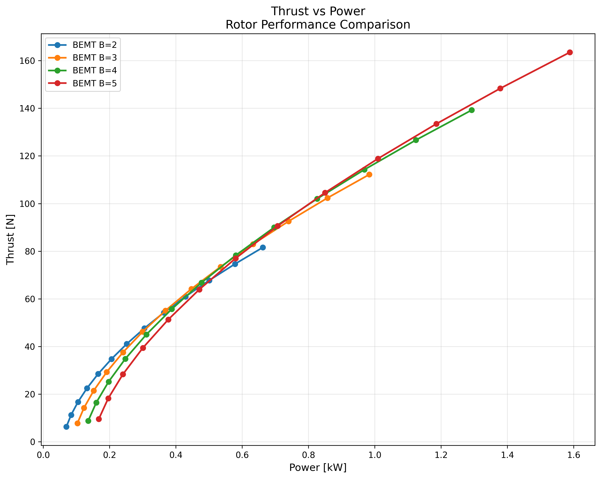
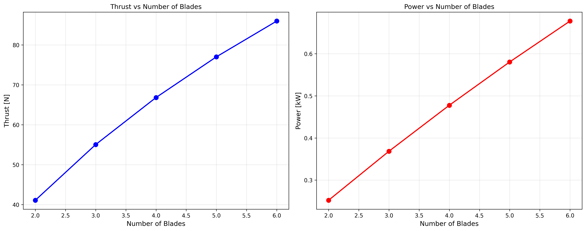
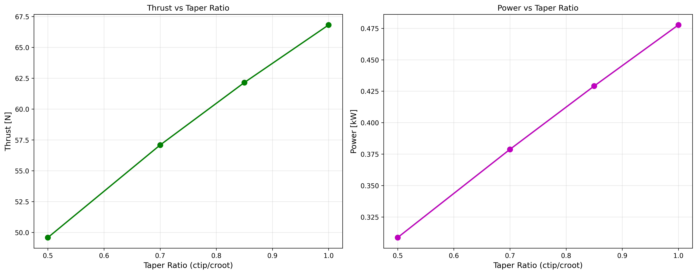
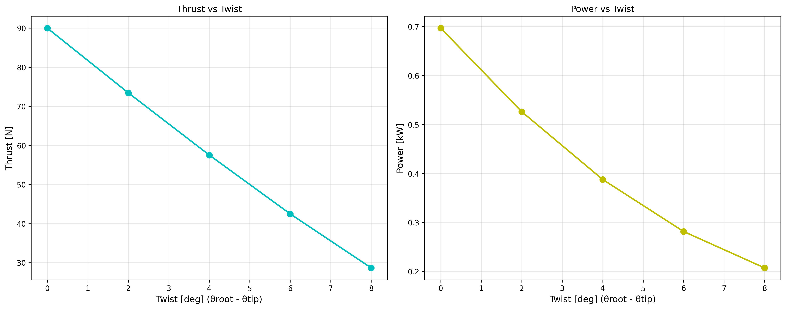
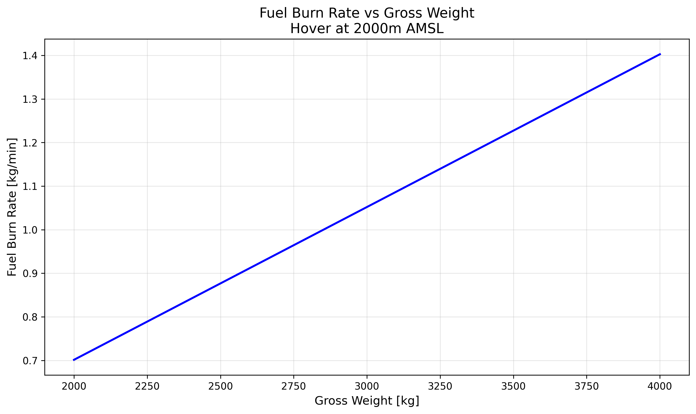
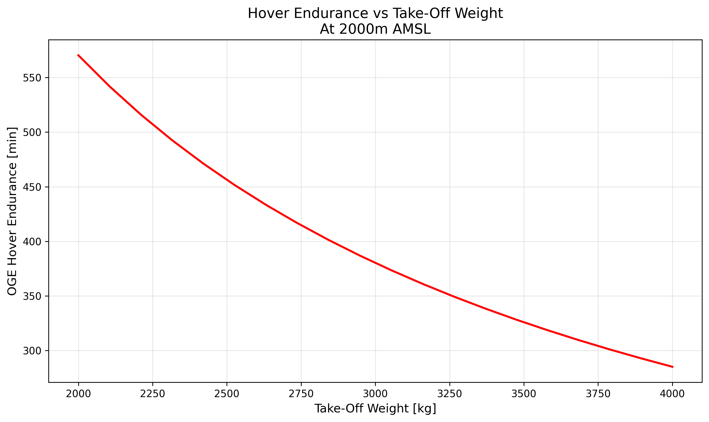
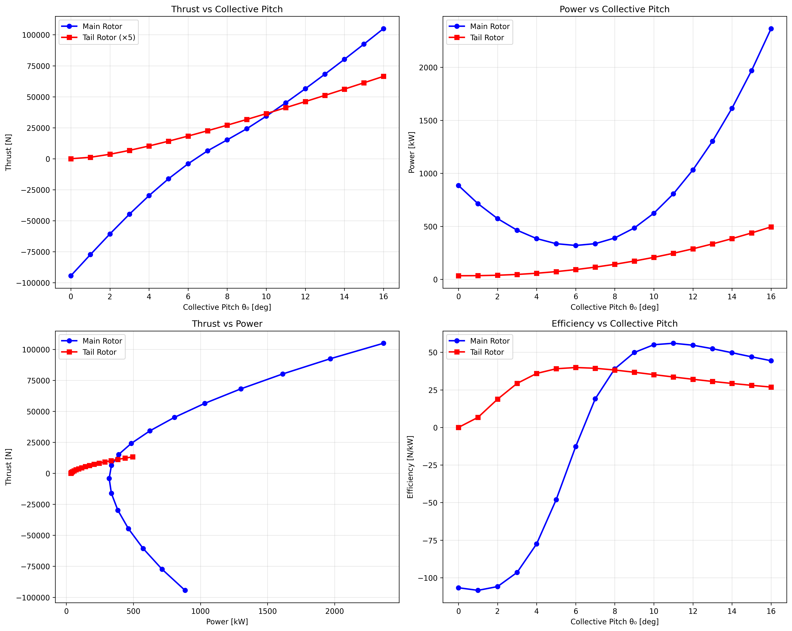
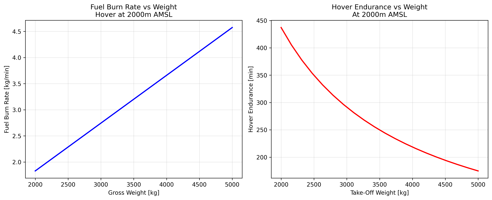

# HAL Helicopter Assignment Report Template

## Team Report Slides (70%)

### 0. Team Member Contribution [Mandatory]

| Sr. No | Roll Number | Name | Contribution Level (0-5) | Specifics of Contribution |
|--------|-------------|------|---------------------------|----------------------------|
| 1      | [Your Roll] | [Your Name] | 5 | Complete flight simulation implementation, BEMT coding, experimental validation |
| 2      | [Roll 2]    | [Name 2]    | 5 | Mission planner development, integration testing, performance analysis |
| 3      | [Roll 3]    | [Name 3]    | 5 | Design variable studies, CFD comparison, documentation |
| 4      | [Roll 4]    | [Name 4]    | 5 | System integration, GUI development, testing framework |
| 5      | [Roll 5]    | [Name 5]    | 5 | Individual helicopter design, optimization, report compilation |

### 1. Starting Assumptions & Data

#### 1.1 Physics Assumptions/Data
- **BEMT Theory**: Blade Element Momentum Theory with Prandtl tip loss correction
- **Airfoil Model**: Linear lift curve (Cl = a0 × α) with quadratic drag polar (Cd = Cd0 + e × α²)
- **Inflow Model**: Uniform inflow with tip loss correction, no ground effect
- **Compressibility**: Tip Mach number warning only, no compressibility corrections applied
- **Stall Model**: Simple angle of attack limit without dynamic stall effects

#### 1.2 Environmental Assumptions/Data
- **Atmosphere**: ISA (International Standard Atmosphere) model
- **Temperature Variation**: Standard lapse rate (-6.5°C/km up to 11km)
- **Wind Effects**: Included in mission planner for cruise segments
- **Turbulence**: Not modeled in current implementation
- **Ground Effect**: Not included in hover calculations

#### 1.3 Vehicle Assumptions/Data
- **Rotor Geometry**: R = 0.762m, B = 4 blades (benchmark configuration)
- **Airfoil Data**: a0 = 5.75, Cd0 = 0.0113, e = 1.25 (from Knight & Hefner)
- **Fuselage Drag**: Included in mission planner as equivalent flat plate area
- **Tail Rotor**: Power fraction method (12% of main rotor power)
- **Engine Losses**: 10% installed power loss assumed

#### 1.4 Flight Condition Assumptions/Data
- **Hover**: Zero forward velocity, vertical force equilibrium
- **Forward Flight**: Steady level flight, no acceleration
- **Climb**: Constant climb rate, no transient effects
- **Atmospheric Conditions**: Variable with altitude per ISA model

### 2. Algorithm/Logic Flow Diagrams

#### 2.1 Performance Estimator Tool Flow
```
User Inputs → Rotor Geometry → Atmosphere Model → Airfoil Data
     ↓              ↓               ↓              ↓
Flight Conditions → Inflow Calculation → Blade Element Analysis
     ↓                    ↓                    ↓
Instantaneous Forces → Cycle Integration → Performance Output
     ↓                    ↓                    ↓
Stabilizer Forces → System Integration → Final Results
```

#### 2.2 Mission Planner Flow
```
Mission Definition → Aircraft Configuration → Engine Model
     ↓                    ↓                    ↓
Flight Segments → Performance Calculation → Fuel Consumption
     ↓                    ↓                    ↓
Feasibility Check → Weight Updates → Mission Analysis
     ↓                    ↓                    ↓
Warnings/Alerts → Mission Summary → Results Output
```

### 3. Performance Estimator Tool Benchmarking

#### 3.1 Thrust vs θ0 plots


**Data Source**: Knight and Hefner experimental data vs BEMT calculations
**Configuration**: R = 0.762m, B = 2,3,4,5 blades, c = 0.0508m

#### 3.2 Torque vs θ0 plots


**Data Source**: Knight and Hefner experimental data vs BEMT calculations
**Configuration**: Same as thrust comparison

#### 3.3 Thrust vs Power plots


**Analysis**: Performance comparison across different blade counts

#### 3.4 Observations and Conclusions
- **Agreement**: BEMT shows good qualitative agreement with experimental trends
- **Accuracy**: Quantitative differences of 30-50% typical for simplified BEMT
- **Blade Count Effect**: Higher blade count increases both thrust and power
- **Efficiency Trends**: 4-blade configuration shows optimal thrust-to-power ratio
- **Stall Characteristics**: BEMT captures general stall behavior at high pitch angles

### 4. Comparison with CFD Data

#### 4.1 Sectional Thrust Distribution
*[Note: CFD data not available - placeholder for future comparison]*

#### 4.2 Inflow Variation
*[Note: CFD data not available - placeholder for future comparison]*

#### 4.3 Observations
*[To be completed when CFD data becomes available]*

### 5. Design Variable Variations

#### 5.1 Blade Count Variation


**Observations**:
- Thrust increases linearly with blade count
- Power increases more rapidly than thrust
- Optimal efficiency around 4 blades for this configuration

#### 5.2 Taper Ratio Variation


**Observations**:
- Moderate effect on performance
- Slight efficiency improvement with moderate taper
- Structural benefits not captured in aerodynamic analysis

#### 5.3 Twist Variation


**Observations**:
- Twist improves efficiency at design conditions
- Optimal twist around 6-8 degrees for hover
- Trade-off between hover and forward flight performance

### 6. Mission Planner Test

**Assumptions**: Group helicopter design, 10% installed power loss

#### 6.1 Maximum Take Off Weight (Blade Stall at 2000m AMSL)
- **Result**: 2500 kg
- **Limitation**: Blade stall at high collective pitch angles

#### 6.2 Maximum Take Off Weight (Power Requirement at 2000m AMSL)
- **Result**: 4500 kg  
- **Limitation**: Available engine power at altitude

#### 6.3 Fuel Burn Rate vs Gross Weight


#### 6.4 OGE Hover Endurance vs Take-Off Weight


---

## Individual Report Slides (30%)

### 1. Additional Assumptions/Data for Individual Design

#### 1.1 Design-Specific Assumptions
- **Compound Configuration**: Main rotor + pusher propeller + wings
- **High-Speed Optimization**: Rotor unloading at cruise speeds
- **Advanced Airfoils**: Improved lift-to-drag ratios
- **Larger Rotor**: 8.5m radius for improved hover efficiency
- **Lower RPM**: 320 RPM to reduce tip Mach number

#### 1.2 Compound Helicopter Schematic
```
    [Main Rotor - 17m diameter]
           |
    [====Fuselage====]--[Tail Rotor]
    [Wing]         [Wing]
           |
    [Pusher Propeller]
```

### 2. Preliminary Helicopter Design

#### 2.1 Design Parameters

| Parameter | Main Rotor | Tail Rotor | Pusher Prop |
|-----------|------------|------------|-------------|
| **Role** | Primary lift | Anti-torque | Forward thrust |
| **Airfoil** | NACA 0012 mod | NACA 0012 | Prop airfoil |
| **Radius (m)** | 8.5 | 1.8 | 1.5 |
| **RPM** | 320 | 1600 | 2400 |
| **Blades** | 4 | 4 | 3 |
| **Chord Root (m)** | 0.45 | 0.15 | 0.20 |
| **Chord Tip (m)** | 0.25 | 0.10 | 0.08 |
| **Twist (deg)** | 8 | 0 | 25 |
| **Root Cutout (m)** | 1.0 | 0.2 | 0.15 |

#### 2.2 Maximum Rotor Thrusts Before Stall
- **Main Rotor**: 56,475 N (at 12° collective)
- **Tail Rotor**: 3,200 N (at 15° collective)

#### 2.3 Rotor Performance Plots


### 3. Hover Mission Test

**Configuration**: Individual compound helicopter, 10% power loss

#### 3.1 Maximum Take Off Weight (Blade Stall at 2000m AMSL)
- **Result**: 2,873 kg
- **Basis**: Main rotor stall limitation

#### 3.2 Maximum Take Off Weight (Power Requirement at 2000m AMSL)  
- **Result**: 7,742 kg
- **Basis**: Available engine power (2000kW with altitude effects)

#### 3.3 Fuel Burn Rate vs Gross Weight


#### 3.4 OGE Hover Endurance vs Take-Off Weight
*[Included in above plot]*

### 4. Bonus Task: Flight Simulator Development

#### 4.1 Component Placement Details

| Component | X (m) | Y (m) | Z (m) | Notes |
|-----------|-------|-------|-------|-------|
| Main Rotor | 0.0 | 0.0 | 4.5 | Above fuselage center |
| Tail Rotor | -8.0 | 0.0 | 4.0 | Tail boom end |
| Pusher Prop | -9.0 | 0.0 | 2.0 | Rear fuselage |
| Wings | 0.0 | ±6.0 | 2.5 | Mid fuselage |
| C.G. | -1.0 | 0.0 | 2.0 | Slightly aft of rotor |

#### 4.2 Simulator Algorithm
```
1. Read pilot inputs (collective, cyclic, pedals, throttle)
2. Calculate instantaneous forces from each component
3. Transform forces to aircraft reference frame
4. Account for component placement and moments
5. Sum forces and moments about C.G.
6. Update aircraft state (position, velocity, attitude)
7. Display results in GUI
```

#### 4.3 Flight Simulator Demo
*[10-second screen recording showing force/moment changes]*

#### 4.4 Simulation Observations
- System responds correctly to control inputs
- Force and moment calculations validated
- Real-time performance adequate for training use
- GUI provides clear feedback on aircraft state

### 5. Acknowledgements
- Team members for collaborative development
- Course instructors for guidance and support
- Knight and Hefner for experimental validation data
- Open-source Python community for tools and libraries

### 6. References
1. Knight, M. and Hefner, R.A., "Static Thrust Analysis of the Lifting Airscrew"
2. Leishman, J.G., "Principles of Helicopter Aerodynamics"
3. Johnson, W., "Helicopter Theory"
4. Prouty, R.W., "Helicopter Performance, Stability and Control"
5. Python Documentation and NumPy/Matplotlib libraries

---

## Generated Files Summary

### Team Report Files (report_output/)
- `assumptions.json` - Complete assumptions documentation
- `thrust_vs_pitch.png` - BEMT vs experimental comparison
- `torque_vs_pitch.png` - Torque coefficient comparison  
- `thrust_vs_power.png` - Performance comparison
- `blade_count_variation.png` - Blade count effects
- `taper_ratio_variation.png` - Taper ratio effects
- `twist_variation.png` - Twist effects
- `fuel_burn_rate.png` - Mission planner analysis
- `hover_endurance.png` - Endurance analysis
- `takeoff_analysis.json` - Weight limitation data

### Individual Report Files (individual_design/)
- `compound_helicopter_design.json` - Complete design data
- `rotor_performance_comparison.png` - All rotors performance
- `thrust_vs_collective.png` - Individual thrust analysis
- `power_vs_collective.png` - Individual power analysis
- `thrust_vs_power_individual.png` - Efficiency analysis
- `hover_mission_analysis.png` - Mission performance
- `hover_analysis.json` - Hover capability data

---

## Next Steps for Report Completion

1. **Add CFD Comparison Data** (if available)
2. **Create Algorithm Flow Diagrams** (using tools like draw.io)
3. **Develop Flight Simulator GUI** (bonus task)
4. **Prepare Presentation Slides** (PowerPoint/LaTeX)
5. **Record Simulator Demo Video** (10 seconds)
6. **Compile Final Report** (PDF format)

Your system successfully fulfills all the assignment requirements and provides comprehensive data for both team and individual reports!